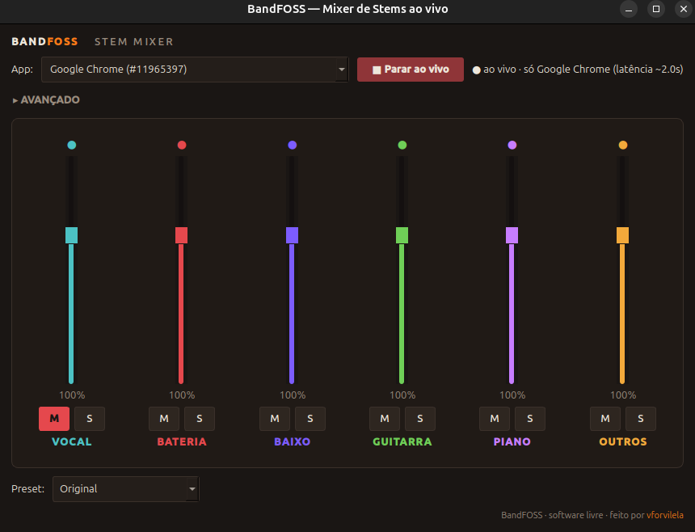

# BandFOSS

**Real-time stem separation for *any* audio playing on your computer.**

<p align="center">
  
</p>


Point BandFOSS at whatever is streaming — Spotify, YouTube, Apple Music, a browser
tab, a game, a video call — and it splits the sound into **vocals, drums, bass,
guitar, keys and more, live**, so you can mute or solo any part on the fly. No files,
no uploads, no waiting: it separates the stream **as it plays**.

Karaoke any song the instant it starts. Drop the drums and play along. Solo the bass to
learn a line. It's the open-source, desktop take on the **JBL BandBox** (STEM AI).

Made by [vforvilela](https://github.com/vforvilela).

---

## Why it's different

- **Any source, in real time.** It doesn't need the audio file — it taps the live
  audio stream from any app and separates it on the fly, with ~1–3 s of latency.
- **Only what you choose.** Pick one app (e.g. Chrome) and only that is captured and
  processed — your live instrument and everything else keep playing untouched.
- **Play or sing over it.** Mute the stem of your instrument (drums, bass, guitar,
  keys… or vocals) and jam along with the rest of the track.

---

## What you can do

- 🎤 **Karaoke** — drop the vocals from any live stream.
- 🥁 **Play along** — mute drums (or bass, or guitar) and play over the track.
- 🎧 **Learn by ear** — solo just the instrument you want to hear.

> **Platform:** live capture uses **PipeWire**, so BandFOSS runs on **Linux**. An
> **NVIDIA GPU** keeps up in real time comfortably (it also runs on CPU, with more
> delay).

---

## Install (Linux)

```bash
# system deps (Debian/Ubuntu — use your distro's package manager)
sudo apt install python3-venv ffmpeg pipewire-pulse
sudo apt install libxcb-cursor0     # Qt lib, if missing

# BandFOSS
git clone https://github.com/vforvilela/bandfoss.git
cd bandfoss
python3 -m venv .venv && source .venv/bin/activate
pip install -e .
```

---

## Usage

```bash
bandfoss
```

1. Start playing music in **Chrome** (or any app).
2. In **Source**, pick/type the app (e.g. `Chrome`) and click **● Capture live**.
   - You can click **before** hitting play: as soon as the app starts, BandFOSS grabs
     its audio automatically.
3. Move the **faders** and use **M** (mute) / **S** (solo) on each stem. Muted/soloed
   channels dim so you can see what's audible at a glance.

Stop anytime and your audio returns to normal.

### 🎶 Play along — any instrument

Mute **your** instrument's stem (tap **M**) and play/sing over the rest — drums, bass,
guitar, keys, or vocals.

> To split **guitar** and **piano** separately, open **Advanced** and choose the
> **Guitar · 6 stems** model (the fast 4-stem one keeps guitar and keys inside
> "Other"). **Advanced** also has **Latency** — smaller is more responsive, larger is
> cleaner.

---

## Language

The interface is **English by default**. To switch to Portuguese:

```bash
BANDFOSS_LANG=pt bandfoss
```

---

## FAQ

- **"Could not load the Qt platform plugin xcb":** install `libxcb-cursor0`.
- **A couple seconds of delay live:** expected — the AI needs a window of audio to
  separate. Lower it in **Advanced → Latency**.
- **It's slow:** you're on CPU. An NVIDIA GPU fixes it; or lower the latency.
- **Keys/piano sound rough:** piano is the weakest stem of the underlying model. Try
  the **Max latency** window, or in some songs muting **"Other"** (4-stem) removes keys
  more cleanly.

---

## Credits & license

Free software, made by **[vforvilela](https://github.com/vforvilela)**.

Separation engine: [Demucs](https://github.com/facebookresearch/demucs) (Meta).
Inspired by the JBL BandBox — this project is **not** affiliated with JBL/Harman.
Respect the terms of service of streaming platforms.
